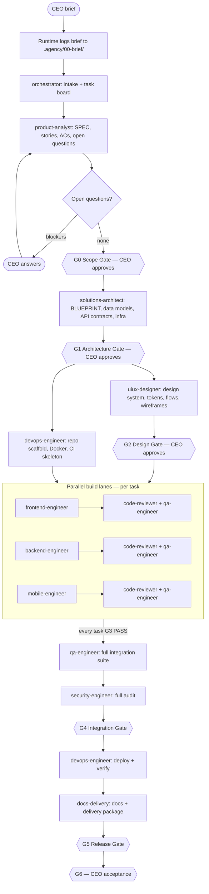

# End-to-End Delivery Workflow

How a project flows from CEO brief to final delivery. The Agency Runtime (main Claude
session) executes this flow by dispatching subagents; the Orchestrator plans and verifies
every step. Gates and protocols are defined in `CLAUDE.md`.



---

## Stage by stage

### Stage 0 — Intake
**Trigger:** CEO sends a brief (one sentence or twenty pages — both work).
1. Runtime writes the brief verbatim to `.agency/00-brief/BRIEF.md`, plus a one-paragraph restatement.
2. Dispatch `orchestrator` → classifies the project, right-sizes the pipeline, creates
   `TASKBOARD.md` and `STATUS.md`, and reports the plan to the CEO (5–10 lines).
- **CEO touchpoint:** receives the plan; no approval needed yet.

### Stage 1 — Specification → G0
1. Dispatch `product-analyst` → `SPEC.md`, `user-stories.md`, `acceptance-criteria.md`, `open-questions.md`.
2. Orchestrator verifies traceability (FR ↔ story ↔ AC) and triages questions.
3. Blocking questions go to the CEO **batched once**, each with options + a recommended default.
4. **G0:** CEO approves scope. Recorded in `.agency/05-reports/gates/`.

### Stage 2 — Architecture → G1 (the hard wall)
1. Dispatch `solutions-architect` → `BLUEPRINT.md`, `data-models.md`, `api-contracts.md`,
   `infrastructure.md`, ADRs.
2. Orchestrator reviews: every requirement mapped, contracts complete, build order with
   parallelism defined.
3. **G1:** CEO gets a one-screen briefing (stack, shape, key trade-offs, cost implications)
   and approves. **No production code exists before this moment — iron rule §3.1.**

### Stage 3 — Design + Foundations → G2 (parallel)
Two lanes run simultaneously after G1:
- `uiux-designer` → design system, `tokens.json`, user flows, wireframes → **G2: CEO approves the look.**
- `devops-engineer` → repo scaffold per blueprint, Dockerized local dev, CI pipeline skeleton.
Backend tasks that don't need design (schema, auth, core APIs) may start now — they only need G1.

### Stage 4 — Parallel build → G3 per task
The Orchestrator releases tasks as their dependencies clear. Independent tasks are
dispatched **in parallel** (frontend, backend, mobile lanes concurrently; worktree
isolation if files overlap).

Every single task runs this loop:
```
engineer builds (reads blueprint + contracts + design + ACs)
  → self-check (build, lint, tests — mandatory, with evidence)
  → code-reviewer verdict + qa-engineer checkpoint   ← dispatched in parallel
  → both PASS? → G3 ✓, task DONE, dependents unblocked
  → either FAIL? → back to the same engineer with the findings (attempt +1)
  → 3 failed attempts? → orchestrator re-plans (split / new approach / reassign)
       → still failing? → CEO decision with options
```
- **CEO touchpoint:** none, unless escalated. The Orchestrator posts STATUS.md updates
  at milestones.

### Stage 5 — Integration → G4
When all build tasks are G3-done:
1. `qa-engineer` → full integration suite: cross-component E2E, contract conformance
   from both sides, NFR spot-checks.
2. `security-engineer` → full audit: secrets, dependencies, injection, authn/z, web/mobile
   hardening, infra, data protection.
3. Defects become board tasks for the owning engineers; fixes re-enter the G3 loop;
   QA/security re-verify. **G4 passes only with QA PASS + security PASS (no CRITICAL/HIGH).**

### Stage 6 — Release & documentation → G5
1. `devops-engineer` → deploy to target environment(s), verify health checks, confirm rollback.
2. `docs-delivery` → README, API docs, deployment/ops guides — every instruction executed
   and verified — plus `.agency/06-delivery/DELIVERY.md`.
3. **G5:** Orchestrator confirms deployment evidence + docs completeness.

### Stage 7 — Acceptance → G6
The Orchestrator presents the delivery package: what was built, how to see it running,
quality evidence, known limitations, handover inventory.
- **CEO touchpoint:** final sign-off, or change requests — which re-enter at Stage 1
  (spec delta) per iron rule §3.6.

---

## Failure & change loops (summary)

| Event | Route |
|---|---|
| Review/QA FAIL | Same engineer fixes → re-review (attempts tracked) |
| 3 strikes on a task | Orchestrator re-plans → CEO options if still stuck |
| Engineer hits a contract/blueprint problem | → orchestrator → solutions-architect (ADR + delta) → affected tasks updated |
| CEO changes scope mid-build | → product-analyst (spec delta) → architect (blueprint delta) → board updated — never patched directly into code |
| Security CRITICAL/HIGH at G4 | Blocks release; owning engineer fixes; security re-audits |

## CEO involvement — the complete list
1. Send the brief (Stage 0)
2. Answer one batched question set, if any (Stage 1)
3. Approve scope — G0
4. Approve architecture — G1
5. Approve design — G2
6. Decide escalations, if any arise (rare)
7. Provide deploy secrets/credentials when DevOps requests them (names specified, values yours)
8. Accept delivery — G6

Everything else is the agency's job.
